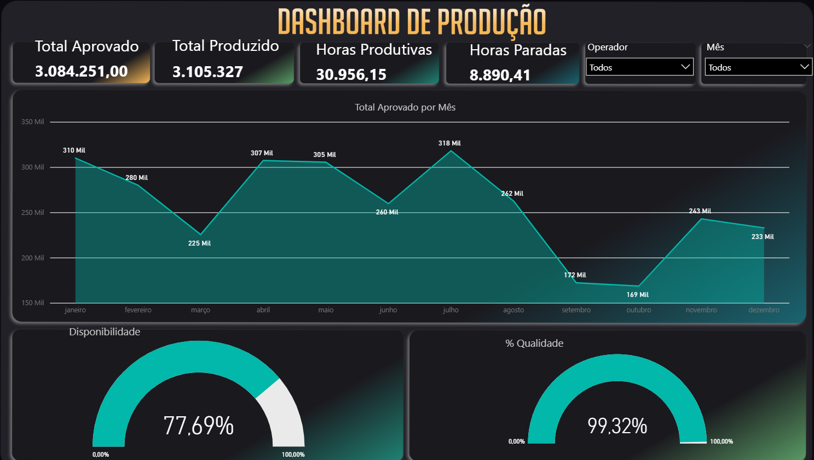
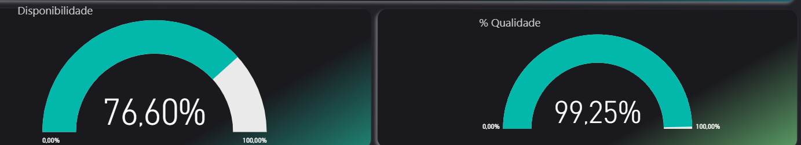

> Dados fictícios, utilizados para fins educacionais.

# Analise-de-desempenho-produção

## 1. Problema de Negócio

A indústria enfrenta dificuldades para acompanhar, de forma clara e consolidada, o desempenho da produção ao longo do tempo.

A falta de visibilidade sobre horas produtivas, horas paradas, desempenho individual dos funcionários e qualidade das peças produzidas dificulta a identificação de gargalos, impacta a eficiência operacional e pode gerar perdas financeiras e retrabalho.

O principal desafio do negócio é entender onde o tempo está sendo perdido, quais colaboradores apresentam maior ou menor produtividade, o nível de disponibilidade da operação e como a qualidade da produção evolui ao longo dos meses, permitindo ações corretivas baseadas em dados.

## 2. Contexto

A operação industrial é composta por diversos fatores que impactam diretamente a produtividade e a qualidade, tais como:

- horas de produtivo,

- horas de paradas,

- disponibilidade dos funcionários,

- desempenho individual,

- quantidade de peças produzidas,

- total de peças aprovadas e reprovadas,

variação da qualidade ao longo dos meses.

O objetivo deste projeto é transformar dados brutos de produção em insights acionáveis, utilizando análises descritivas e visualizações simples, capazes de serem compreendidas.

## 3. Premissas da Análise

Para a realização da análise, foram adotadas as seguintes premissas:

As horas de trabalho são classificadas em horas produtivas e horas paradas.

A disponibilidade (%) foi calculada com base na relação entre horas produtivas e horas totais disponíveis.

coloquei um grafico que possibilita visualizar o desempenho dos funcionários individualmente, considerando tempo produtivo e tempo parado e a qualidade das peças.

- A qualidade foi medida pela horas produtivas / horas trabalhadas.

- As análises foram realizadas com foco em identificação de padrões operacionais, não em causalidade estatística.

O período analisado representa uma amostra válida do comportamento operacional recente da indústria.

## 4. Estratégia da Solução

A estratégia adotada seguiu uma abordagem estruturada de análise de dados:

### 4.1 Entendimento do problema de negócio

Definir claramente os indicadores-chave de desempenho (KPIs) da produção industrial.

### 4.2 Exploração e organização dos dados

Análise das colunas disponíveis, tipos de dados, tratamento de inconsistências e padronização das informações.

### 4.3 Análise descritiva

Cálculo de métricas como:

- horas totais de produção,

- horas totais de paradas,

- taxa de disponibilidade (%),

- quantidade total de peças produzidas,

### 4.4 Segmentação da produção

Avaliação do desempenho por diferentes dimensões:

- funcionário,

- período (mês),

- tipo de hora (produtiva ou parada).

## 4.5 Visualização dos dados

Criação de gráficos e indicadores claros para facilitar a interpretação e comunicação dos resultados com o negócio.

  
  

## 5. Insights da Análise

A análise dos dados permitiu identificar padrões relevantes, como:

- Existe uma diferença significativa entre horas produtivas e horas paradas ao longo dos meses.

- Alguns funcionários apresentam maior tempo produtivo e alta taxa de disponibilidade.

- Outros funcionários concentram maiores volumes de horas paradas, indicando possíveis gargalos operacionais ou manuntenção dos equipamentos.

- A disponibilidade média da operação se mantém estável, porém com variações individuais relevantes.

- A qualidade da produção melhora em determinados meses, refletida no aumento do número de peças aprovadas.

- Os meses com maior volume de produção também apresentam maior quantidade absoluta de peças aprovadas.

- A análise consolidada mostra que a maior parte das peças produzidas é aprovada, mas ainda existem oportunidades de redução de retrabalho.

  
  

Esses insights indicam que os problemas de produtividade e qualidade não são aleatórios, mas estão associados a padrões operacionais específicos.

## 6. Resultados

Como resultado do projeto, foram obtidos:

- Visão consolidada das horas produtivas e horas paradas da operação.

- Possibilitar em visualizar o desempenho individual de cada funcionário.

- Cálculo da taxa de disponibilidade (%) por funcionário e da operação como um todo.

- Monitoramento da qualidade da produção por meio da quantidade de peças aprovadas.

- Análise mensal da evolução da produção e da qualidade.

- Diagnóstico visual dos principais gargalos operacionais.

- Base analítica para apoiar decisões da área industrial.

Além disso, o projeto demonstra como a análise de dados pode transformar informações operacionais em decisões práticas, mesmo utilizando técnicas analíticas simples.

7. Próximos Passos

Com base nos resultados obtidos, os próximos passos recomendados são:

- Investigar as causas das horas paradas mais recorrentes.

- Criar planos de ação específicos para funcionários ou períodos com baixo desempenho.

- Monitorar continuamente a disponibilidade da produção por meio de dashboards.

- Integrar dados de manutenção para análise mais profunda das paradas.

- Aprofundar a análise da qualidade, identificando causas de reprovação.

  

### Observação: os dados utilizados neste projeto são fictícios de estudo, com finalidade exclusivamente educacional e demonstrativa,
📌 O dashboard foi desenvolvido no Power BI Desktop.
 📌Prints foram utilizados devido à não publicação online do relatório. 
